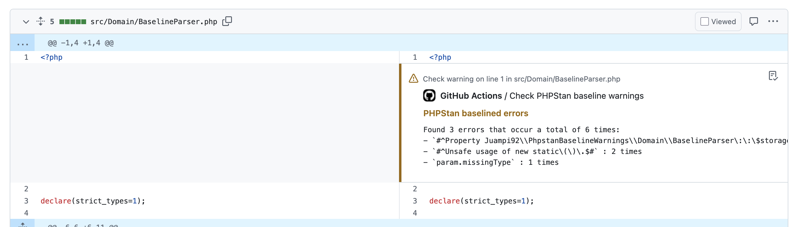

# PHPStan Baseline Warnings

<p align="center">
    <a href="https://packagist.org/packages/juampi92/phpstan-baseline-warnings"></a>
    <a href="https://packagist.org/packages/juampi92/phpstan-baseline-warnings"></a>
    <a href="https://github.com/juampi92/phpstan-baseline-warnings/actions?query=workflow%3Atests+branch%3Amain"></a>
    <a href="https://packagist.org/packages/juampi92/phpstan-baseline-warnings"></a>
</p>

**TL;DR:** Compare your PR's changed files with your PHPStan baseline, and let developers know they modified a file that has skipped errors, prompting them to fix them!

```
$ vendor/bin/phpstan-baseline-warnings src/Foo.php src/Bar.php src/Baz.php

::warning file=src/Foo.php,line=0,title=Found 3 errors that occur a total of 6 times:%0A- `#^Property Juampi92\\PhpstanBaselineWarnings\\Domain\\BaselineParser\:\:\$storage is never read, only written\.$#` : 3 times%0A- `#^Unsafe usage of new static\(\)\.$#` : 2 times
::warning file=src/Baz.php,line=0,title=Found 1 errors that occur a total of 2 times:%0A- `#^Unsafe usage of new static\(\)\.$#` : 2 times
```

It also comes avaialble as a [github action](#github-action)!

<p align="center">
    
</p>

A Composer package that analyzes PHPStan baseline files and generates GitHub PR warning annotations for files with baseline-ignored errors. This helps teams maintain code quality by highlighting technical debt that's been temporarily suppressed through baselines whenever that file is modified.

## Installation

You can install the package via composer, or directly using a github action (see below).

```bash
composer require --dev juampi92/phpstan-baseline-warnings
```

## Usage

After installing, you can run the command to analyze specific files against your PHPStan baseline:

```bash
# Basic usage with default baseline path
vendor/bin/phpstan-baseline-warnings src/MyClass.php src/OtherClass.php

# Specify a custom baseline path and base directory
vendor/bin/phpstan-baseline-warnings \
    --baseline-path=tools/phpstan-baseline.neon \
    --base-dir=../ \
    src/Domain/Entity/Post.php \
    src/Domain/Repository/PostRepository.php
```

The command will:
1. Read your PHPStan baseline file (default: `phpstan-baseline.neon`)
2. Check if the provided files have any baseline-ignored errors
3. Generate GitHub-compatible warning annotations for those files

### Options

- `--baseline-path`: Path to your PHPStan baseline file (default: `./phpstan-baseline.neon`)
- `--base-dir`: Base directory for resolving relative paths. Useful when your phpstan config is inside a sub-folder (default: `./`)

## GitHub Action

You can also use this tool as a GitHub Action in your workflows:

```yaml
name: PHPStan Baseline Warnings
on:
  pull_request:

jobs:
  phpstan-baseline-warnings:
    runs-on: ubuntu-latest
    steps:
      - uses: actions/checkout@v4

      - name: PHPStan Baseline Warnings
        uses: juampi92/phpstan-baseline-warnings@v0.4
        with:
          baseline-path: ./phpstan-baseline.neon
          base-dir: ./
```

This will analyze your PHPStan baseline file and create warning annotations in your GitHub repository.

## Contributing

Contributions are welcome! Please feel free to submit a Pull Request.

## License

This package is open-sourced software licensed under the MIT license.
